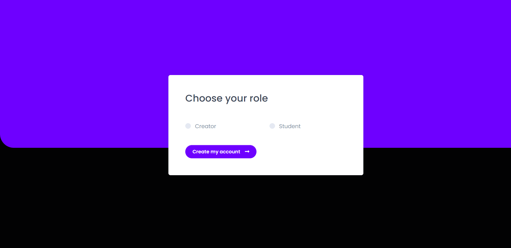

# Learnify Project

## Description
Learnify is a web-based platform where users can create, share, and view video posts, comment on posts, like them, and interact with the community. This project is built using Node.js, Express, MongoDB, and several third-party services like AWS S3 for video and image uploads.

## Table of Contents
- [Installation](#installation)
- [Usage](#usage)
- [Features](#features)
- [Environment Variables](#environment-variables)
- [Technologies Used](#technologies-used)
- [API Endpoints](#api-endpoints)
- [License](#license)

## Installation

### Prerequisites:
1. Node.js (v14 or higher)
2. MongoDB (Local or Atlas)
3. AWS S3 setup for video and image uploads.

### Steps:
1. Clone the repository:
   ```bash
   git clone https://github.com/Srikar4510/learnify.git
   ```
   
2. Install dependencies:
   ```bash
   cd learnify
   npm install
   ```

3. Set up environment variables:
   Create a file called `.env` in the root of your project and add the following:
   ```
   MONGO_URI=your-mongodb-uri
   GOOGLE_CLIENT_ID=your-google-client-id
   GOOGLE_CLIENT_SECRET=your-google-client-secret
   AWS_REGION=your-aws-region
   AWS_ACCESS_KEY_ID=your-aws-access-key
   AWS_SECRET_ACCESS_KEY=your-aws-secret-access-key
   CLOUDFRONT_DDN=your-cloudfront-distribution-url
   ```

4. Run the application:
   ```bash
   npm start
   ```

   The application will run at [http://localhost:3000](http://localhost:3000).

## Usage
### User Authentication
- Users can log in using their Google account via OAuth2.
- After logging in, users can create posts, like, and comment on other users' posts.

### Posts
- Users can create posts by uploading a video and setting a title, subtitle, and description.

### Comments
- Users can comment on posts, reply to comments, and engage in discussions.

## Features
- Google OAuth Authentication.
- Video and image uploads using AWS S3.
- Like and comment system for posts.
- Role-based access control for creators and students.
- search functionality for posts.
- Profile settings, allowing users to change avatars and update details.

## Environment Variables
- **MONGO_URI**: MongoDB connection string.
- **GOOGLE_CLIENT_ID**: Google OAuth client ID.
- **GOOGLE_CLIENT_SECRET**: Google OAuth client secret.
- **AWS_REGION**: AWS region for S3.
- **AWS_ACCESS_KEY_ID**: AWS access key ID.
- **AWS_SECRET_ACCESS_KEY**: AWS secret access key.
- **CLOUDFRONT_DDN**: CloudFront distribution URL for serving uploaded assets.

## Technologies Used
- Node.js
- Express.js
- MongoDB (Mongoose)
- Passport.js (for authentication)
- EJS (for templating)
- AWS S3 (for media uploads)
- Google OAuth 2.0 (for authentication)

## API Endpoints
### Authentication:
- `GET /auth/google` - Initiates Google OAuth authentication.
- `GET /auth/google/callback` - Google OAuth callback URL.
- `GET /auth/logout` - Logs out the user.

### Posts:
- `POST /create/post` - Creates a new post.
- `PATCH /post/like` - Likes a post.
- `DELETE /post/delete` - Deletes a post.

### Comments:
- `POST /create/comment` - Adds a new comment to a post.
- `GET /fetch/reply` - Fetches replies to a comment.

## Screenshots

### Login with Google Page


### Role selection page


### Creator Dashboard


### Create Post Page


### Post Page


### Student Dashboard


### Comments 


## Contributing

If you'd like to contribute to this project, feel free to submit a pull request or open an issue on the GitHub repository.

## License

This project is licensed under the MIT License - see the [LICENSE](LICENSE) file for details.

## Contact

If you have any questions, feel free to reach out:

- **Email**: [srikarambula.1924@gmail.com](mailto:srikarambula.1924@gmail.com)
- **LinkedIn**: [Srikar Ambula](https://www.linkedin.com/in/srikar-ambula-66a647277/)
- **GitHub**: [Srikar4510](https://github.com/Srikar4510)